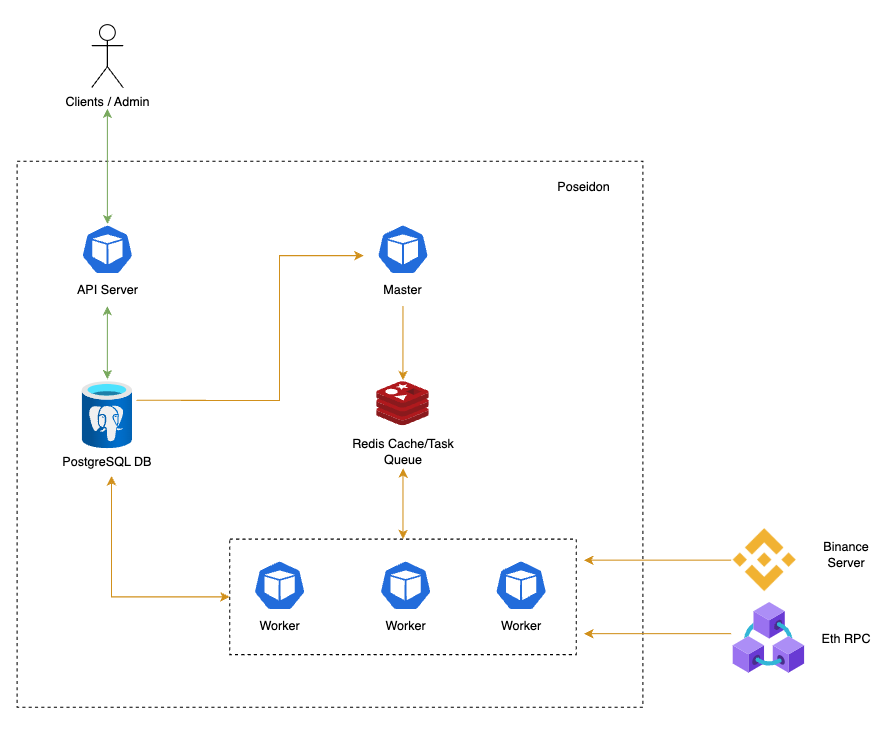
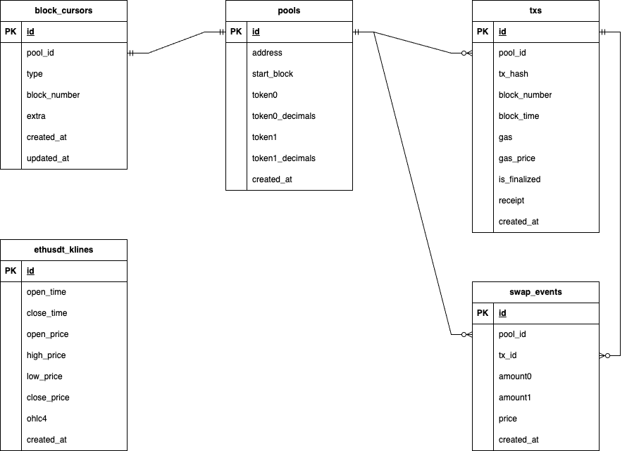

# System Design

# Problem Statement

Require transaction data of some Uniswap V3 pools for trading, liquidity provision analytics, etc.

# Solution

Build Poseidon - A simple and efficient system that ensures the provision of reliable data.

# System Components

Poseidon breaks down into 3 microservices: API Server, Master, and Worker.

## API Server

Provide endpoints for admin (authenticated by API Key), and other clients. 

User stories:

- As an admin, I can request Poseidon to start tracking a new Uniswap V3 pool.
- As a user, I can query transaction data of a pool.
- As a user, I can query fee in USDT of a transaction.
- As a user, I can query swap events of a transaction.

This components can scale horizontally as traffic increases.

## Master

Master queries tracked pools in database as scheduled and enqueues tasks to Redis task queue, which are handled by workers later (task queue pattern).

Enqueue tasks: “scan_txs”, “finalize_txs”.

We have only one single instance of the master running at a time.

## Worker

This component handles and distributes tasks in background.

Tasks:

- Handle event pool created: API Server enqueues an event pool created after creating a new pool in database. Worker dequeues this task type and create data (block_cursors - mentioned below) for further processing.
- Scan txs: Worker queries Eth RPC to get all transactions involved in a pool within a block range. It transforms onchain data, persists to database, and enqueues tasks fetching ETH price back into Redis task queue.
- Finalized txs: This flow is quite similar to “Scan txs”, but there is a lag to ensure Worker only queries finalized blocks, so it can detect reorg by comparing onchain transactions with persisted transactions in database. Some mechanisms are added to reduce lots of calls to Eth RPC.
- Fetch ETH price: Worker queries ETHUSDT Kline data from Binance, and persists it to database.

The number of worker instances can be scaled up when the workload increases.

# Data Model

**Table** **pools**:  contains data of pools created by admin.

**Table txs**: contains on-chain transaction data of a pool. There might be duplicated txs in this table since 1 transaction can involve multiple pools, but it’s insignificant with the business requirements of this system. In addition, the design makes it simple when you want to stop tracking a pool.

**Table swap_events**: swap events decoded from txs.

**Table ethusdt_klines**: ETHUSDT kline data from Binance.

**Table block_cursors**: the progress of 2 flows “scan_txs” and “finalize_txs”.

# Remark

## Architectural Principles

Poseidon employs various principles to make it a clean, scalable, and maintainable application.

### Separation Of Concerns (SoC)

The system is divided into distinct modules and layers, each responsible for a specific aspect or concern. (e.g., presentation, business logic, and data storage). This separation helps ensure that the business model is easy to test and can evolve without being tightly coupled to low-level implementation details.

### Dependency Inversion

Reduces coupling between components, and improves maintainability.

### Single R**esponsibility**

Poseidon is divided into three microservices, with each service has a single responsibility. This approach makes the system straight-forward and easy to scale.

### Don’t Repeat Yourself (DRY)

Easy for source management and changes in requirements.

### Persistence Ignorance

Separate concerns between business logic and data access.

## **Three Key Factors Of The Software**

### Availability

API Server is a HTTP server, it can increase number of instances easily. Requests are distributed across multiple servers to prevent overload on any single server and ensure continuous availability.

### Scalability

The API Server and Workers are able to scale vertically and horizontally because they are stateless. With well-orchestrated infrastructure, the system can handle high workloads and remain stable in performance.

### Reliability

The system has various aspects that affirm its reliability:

- Correctness: by unit tests and integration tests, software produces accurate results and perform its intended functions according to specifications and user expectations.
- Fault tolerance: system has retry mechanisms (in task queue components), as well as robust validation logics, which make the software resilient to failures and errors from external components (e.g., Eth node’s out of sync, Binance server downs) and ensure continuous operation. In addition, comprehensive logging helps detect the root cause of errors easily.
- Data integrity: ensure data consistency, durability, and atomicity, through database transactions.